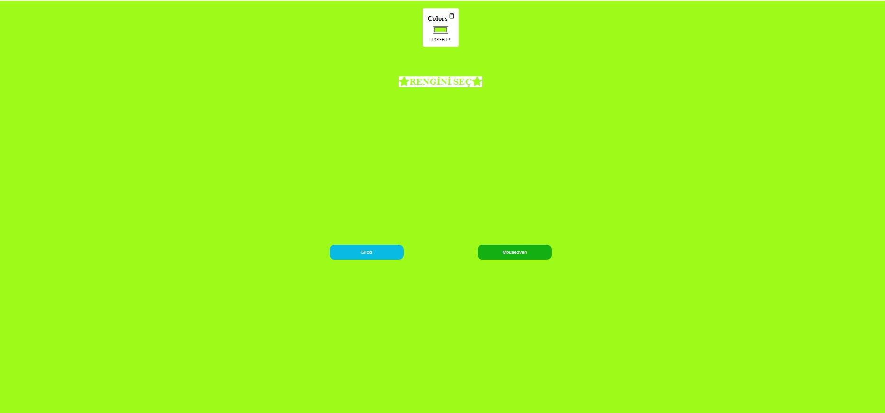
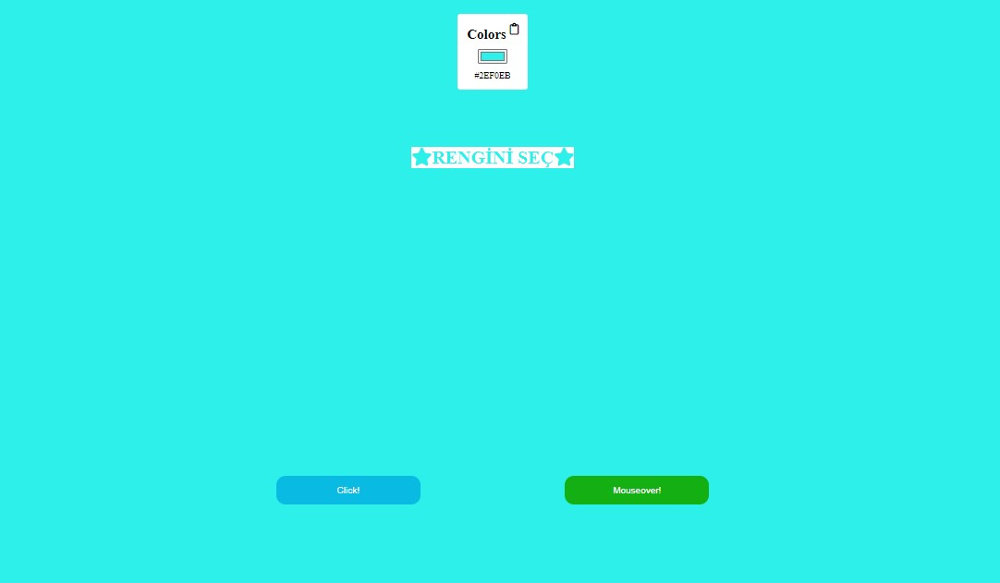

# Color Selector and Background Changer Project

This repository contains an HTML, CSS, and JavaScript project named "Color Selector and Background Changer Project". This project provides a color selector feature that dynamically changes colors. Additionally, users can change the background color by clicking on specific buttons or hovering over a button.

## Technologies Used

- **HTML5**: Used to create the structure of the web page.
- **CSS3**: Used to style and layout the page.
- **JavaScript**: Used for interactions and dynamic features on the page.
- **Font Awesome**: Used for icons.

## Files

- **index.html**: The main HTML file. It contains the structure and elements of the interface.
- **style.css**: The CSS file. It defines the style and layout of the page.
- **app2.js**: The JavaScript file. It is where interactions and dynamic features on the page are implemented.

## Features

- Color Selector: Users can dynamically change the background color by using a color selector.
- Change Color with Buttons: Users can change the background color by clicking on the "Click!" and "Mouseover!" buttons or hovering over them.
- Copy Feature: The color code can be copied to the clipboard by clicking on the color text.

## How to Use

1. Clone the project or download it as a ZIP file.
2. Open the `index.html` file in a web browser.
3. Use the color selector to choose a color or generate random colors by clicking the "Click!" and "Mouseover!" buttons.
4. Copy the color code by clicking on the color text or the copy icon next to it.

## Screenshots

## Live Link

You can visit a live version of the project [here](https://dom-2-pwmm.vercel.app/).

## License

This project is licensed under the MIT License. See the

